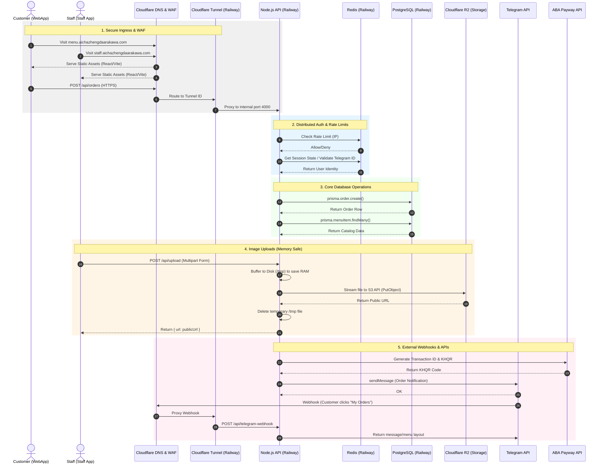

# Ai-Cha Menu Architecture & Data Flow

This document contains the sequence diagram representing the production data flow of the system.
You can use this as a reference to draw your Excalidraw diagram.

