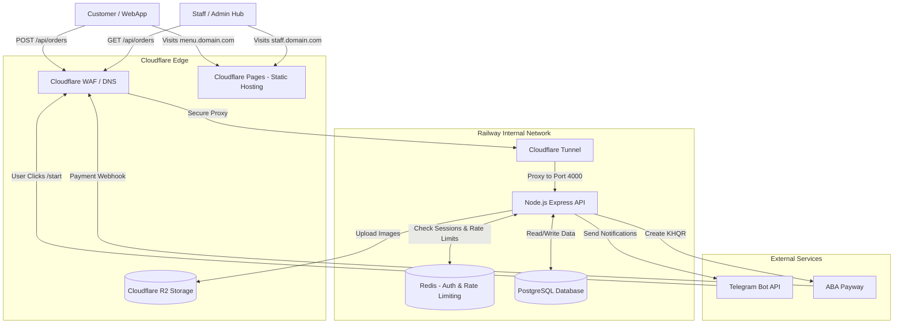
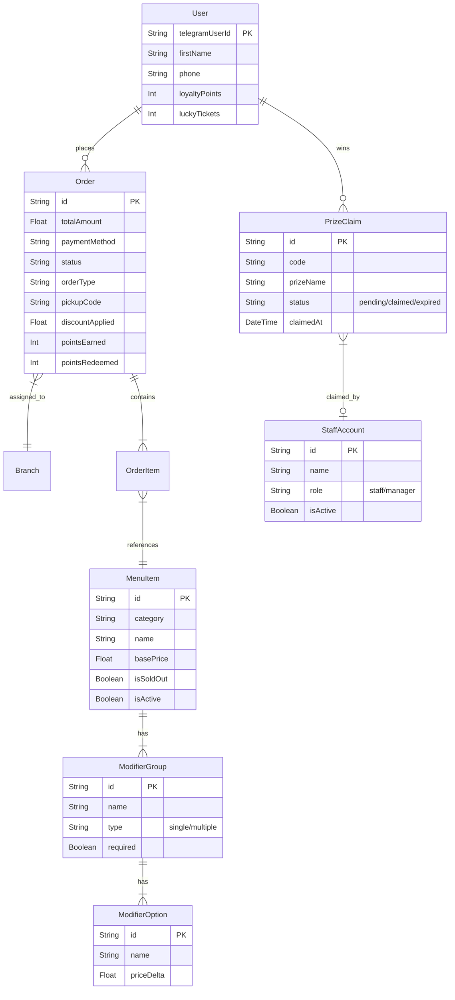
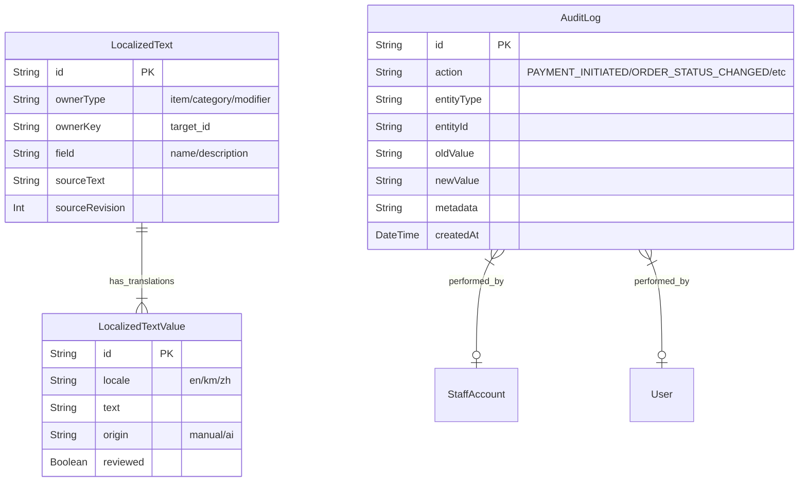

# Ai-Cha Menu Project Diagrams

This document contains standard Mermaid.js diagrams mapping the complete infrastructure, database, and system architecture of the Ai-Cha Menu platform. You can copy the code blocks into [Excalidraw](https://excalidraw.com/) (using the "Insert -> Mermaid" feature), draw.io, or view them directly on GitHub.

## 1. System Architecture & Data Flow

This diagram shows how the user interacts with the system, how data moves through the network, and how the external APIs are connected.

---

## 2. Entity-Relationship (ER) Diagram

This diagram maps the core Prisma database schema, showing how orders, users, menu items, and localized text relate to one another.

---

## 3. Localization & Audit Subsystem

A closer look at the advanced subsystems tracking translations and security audits.

