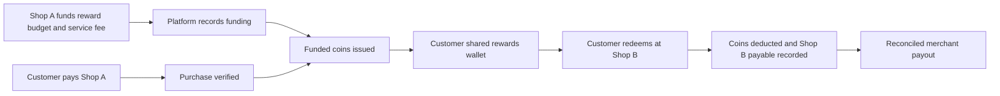

# Program operating model

Proposed rules for validation, not a final software specification or merchant contract.

## Ownership and isolation

One tenant is a merchant business; a tenant may own multiple branches. Each tenant controls its catalog, staff, orders, and reports. A customer has a network identity and a shared rewards wallet. That shared identity does not give Shop A access to purchases or personal details from Shop B.

Separate staff permissions from customer membership. Gold should not automatically mean trusted credit customer, administrator, or permission to bypass payment checks.

## Funding and redemption flow

Proposed pilot sequence:

1. Verify the merchant business, payout beneficiary, staff, and agreement. Publish eligible earn rules and a small reward catalog.
2. Merchant prefunds a capped reward budget through the approved arrangement. Show unused budget, issued funding, service fees, and low-balance warnings separately.
3. Customer pays the merchant through its existing approved checkout. Confirm an actual paid order through a provider record or controlled staff receipt flow. A QR image or customer screenshot alone is not payment confirmation.
4. Issue coins exactly once against that order. Record source shop, customer, amount, funding source, rule version, and reversal linkage.
5. Customer selects a reward at any participating outlet. Show coin cost and any required extra cash before confirmation.
6. Online verification reserves/deducts coins and validates reward availability. Staff fulfills the item; retries cannot create a duplicate claim.
7. Record the redeeming merchant's payable at the locked agreed rate. Reconcile daily and target weekly payouts during the pilot, subject to partner cutoffs and contract terms.
8. Provide statements, disputes, corrections, and refund handling. Every correction retains a history.

The operator should not hold the entire customer's food payment merely to issue rewards. Whether it may hold any reward funds directly is a separate legal/payment-partner question, including for an earned-only program.

## Merchant controls and boundaries

| Merchant can choose | Platform must keep consistent |
|---|---|
| Whether to participate | Meaning and reimbursement rate of each coin |
| Funded earning rate within agreed limits | No coin creation without funding |
| Eligible products, within lawful rules | Clear exclusions before purchase |
| Reward items, coin prices, stock and scheduled availability | Published reward commitments and customer consent |
| Optional funded bonus campaign | Source of funding and maximum exposure |
| Branch participation within the agreement | Tenant boundaries and settlement identity |

Base proposal: no redemption commission on earned coins; the operator earns the issuance service fee. Do not add a second deduction unexpectedly. Later purchased-coin commissions require a separate, explicit agreement.

## Edge cases that must have rules

- **Insufficient merchant budget:** pause new awards before purchase and show the change; do not promise coins then silently fail to issue. Existing funded coins remain redeemable under the agreement.
- **Refund before issuance:** cancel pending coins. **Refund after issuance:** reverse unspent earned coins; if spent, use an agreed recovery/dispute process with audit records rather than silently deducting another merchant's payout.
- **Cancelled redemption:** return coins and reverse the payable exactly once. Refund order cash separately if applicable.
- **Merchant exits:** stop new issuance, honor valid settled claims, reconcile unused funds, and continue supporting outstanding funded customer coins through remaining partners under agreed terms.
- **Internet outage:** record ordinary sales with appropriate existing procedures; queue earning for later verification. Do not allow unverified offline shared-wallet spending in the MVP.
- **Fraud:** monitor staff self-awards, duplicate receipts, invented purchases, colluding merchant/customer redemptions, rapid refund cycles, and account takeover. Use capped issuance, transaction references, role limits, and review.
- **Currency:** show lawful local price information and define the KHR/USD conversion source, timestamp, rounding, and refund handling. Examples in USD are not a proposed fixed exchange rate.

## Gold and $50 top-ups

Recommended default for testing: regular members can earn and redeem. Gold adds benefits, not the basic permission to use coins. The founder has not yet confirmed whether status is network-wide or per shop; **network-wide Gold** is the working proposal.

Candidate earned route: $100 of net eligible purchases across the network in a rolling 90 days, with Gold valid for six months after qualification. These numbers are assumptions to test. Membership progress is separate from spendable coins, so using coins does not remove Gold.

Candidate later paid route: $50 customer top-up qualifies for the same Gold duration, subject to the payment structure and applicable rules. Top-up is a balance purchase, not a nonrefundable membership fee. Count the top-up and subsequent spend under a clearly disclosed rule to avoid accidental double qualification. Refunded top-ups require explicit status treatment.

Possible Gold benefits: access to a funded reward catalog, a limited birthday offer, or a budgeted bonus campaign. Avoid permanent unlimited multipliers until their cost is proven. Giveaways are a separate campaign decision, not an automatic Gold entitlement.

## Customer trust and data

Show where coins can be earned/spent, relevant expiry rules, available rewards, actual coin history, and a support route. Do not promise universal acceptance at every café or every tenant. If expiry is introduced, disclose it and get local advice, especially for purchased value. Do not erase pilot coins on an undisclosed deadline.

Collect only needed customer data. Separate rewards participation from optional marketing consent. Give merchants their own business reporting and appropriately aggregated network results, not competitors' customer lists. Document retention, access, deletion requests, and the need to retain financial records where applicable.
