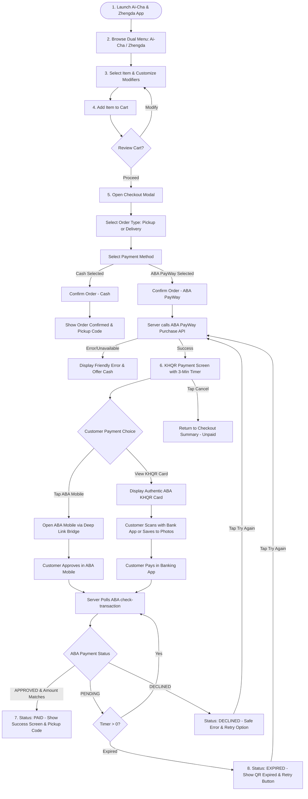
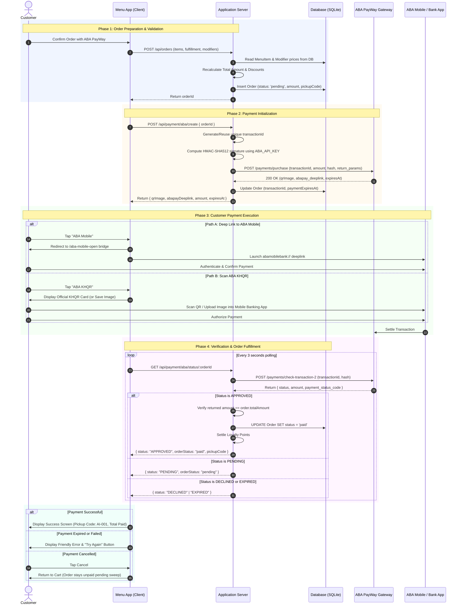

# Ai-Cha & Zhengda — ABA PayWay UI Flow

**Document Version:** 1.0.0  
**Date:** September 2026  
**Target Gateway:** ABA Bank PayWay (ABA Mobile & KHQR)  
**Target Account Type:** ABA Personal / Individual Merchant Account  
**Application Platform:** Telegram Mini App (TMA) & Responsive Web  
**Merchant / Shop Name:** Ai-Cha & Zhengda (Arakawa Branch)  

---

## 1. Document Purpose

This document provides a complete, submission-ready technical and user experience (UX) specification for connecting the **Ai-Cha & Zhengda** customer ordering application to **ABA Bank PayWay**.

It is prepared specifically for two audiences:
1. **ABA Bank E-Merchant Integration & Compliance Reviewers:** To verify that the customer journey, payment presentation, transaction handling, branding, and failure states comply with ABA Bank standards and National Bank of Cambodia (NBC) KHQR guidelines.
2. **Engineering & Operations Teams:** To establish a clear, deterministic baseline of the existing checkout implementation, participant lifelines, API contracts, security boundaries, and required enhancements before moving to production.

> [!IMPORTANT]
> This document details the exact flow implemented in the project codebase, highlights verified sandbox behavior, and details the production flow required for ABA compliance. No payment credentials or secret keys are contained within this document.

---

## 2. Application Overview

| Attribute | Specification Details | Source Reference |
| :--- | :--- | :--- |
| **Application Name** | Ai-Cha & Zhengda (Arakawa Residence Branch) | `README.md`, `PRODUCT.md` |
| **Business Nature** | Food & Beverage (Dual-brand: Ai-Cha drinks & ice cream; Zhengda fried chicken & snacks) | `PRD.md`, `DESIGN.md` |
| **Primary Platform** | Telegram Mini App (TMA) | `@twa-dev/sdk`, `apps/menu` |
| **Secondary Platform** | Mobile & Desktop Web (Responsive) | `apps/menu/src/main.tsx` |
| **Frontend Stack** | React 19, Vite, Tailwind CSS v4, Motion, Phosphor Icons, Lucide Icons, SWR, i18next | `apps/menu/package.json` |
| **Backend API Stack** | Node.js, Express 5, Prisma ORM, SQLite (`dev.db` / `production.db`), Telegraf (Telegram Bot) | `apps/api/package.json` |
| **Staff Dashboard** | React, Vite, Tailwind CSS (Live Kitchen KDS tablet web app) | `apps/staff` |
| **Hosting Infrastructure** | Frontend on Cloudflare Pages; Backend API on Railway | `docs/GO_LIVE_PRODUCTION.md` |
| **Supported Currencies** | USD ($) (Standard denomination for dual-brand menu items) | `apps/api/src/app.ts` |
| **Payment Options** | 1. ABA PayWay (ABA Mobile In-App Deep Link & NBC-compliant KHQR)<br>2. Cash on Handover / Counter Pickup (Restricted to Gold members or store policy) | `apps/menu/src/components/CheckoutModal.tsx` |
| **Customer Authentication** | Telegram `initData` cryptographic validation (`HMAC-SHA256`). Guest browsing permitted; customer identity required for saved address & loyalty points | `apps/api/src/telegram-initdata.ts` |

---

## 3. Current Ordering Journey

The ordering process is currently implemented across `apps/menu` and `apps/api` through the following 8 core steps:

```
[1. Open App] ➔ [2. Browse Menu] ➔ [3. Configure Modifiers] ➔ [4. Review Cart]
                                                                      │
[8. Collect / Track] ◄─ [7. Order Status] ◄─ [6. PayWay Payment] ◄─ [5. Checkout Modal]
```

### Step 1: Application Launch & Store Verification
* **Screen Name:** Landing Screen / Menu Screen
* **Route / URL:** `/` (Telegram WebApp entry or Web fallback)
* **Source Files:** [`apps/menu/src/App.tsx`](file:///Users/rithsila/orca/workspaces/Ai%20Cha%20Menu/staging/apps/menu/src/App.tsx), [`apps/menu/src/main.tsx`](file:///Users/rithsila/orca/workspaces/Ai%20Cha%20Menu/staging/apps/menu/src/main.tsx)
* **User Action:** Customer opens the Telegram bot (`@aicha_zhengda_arakawa_bot`) and taps "Order Now", or opens the web URL.
* **System Action:** 
  1. Telegram WebApp SDK initializes (`tg.ready()`, `tg.expand()`).
  2. Frontend queries `GET /api/store/status` to check store hours and order toggles (`isOpen`, `enablePickup`, `enableDelivery`, `enableKhqr`, `enableCash`).
  3. Frontend queries `GET /api/payment/methods` to verify if ABA credentials are valid on the server.
* **Displayed Information:** Brand header banner (Ai-Cha & Zhengda), store open/closed indicator, dual-brand tabs, category filter pills, menu item grid.
* **Validations:** If store is closed, an informational banner appears and checkout submission is disabled.

### Step 2: Menu Browsing & Brand Selection
* **Screen Name:** Dual-Brand Catalog View
* **Route / URL:** `/` (Tab state: `'menu'`)
* **Source Files:** [`apps/menu/src/App.tsx`](file:///Users/rithsila/orca/workspaces/Ai%20Cha%20Menu/staging/apps/menu/src/App.tsx), [`apps/menu/src/components/ui/BrandTabs.tsx`](file:///Users/rithsila/orca/workspaces/Ai%20Cha%20Menu/staging/apps/menu/src/components/ui/BrandTabs.tsx)
* **User Action:** User toggles between "Ai-Cha" (Drinks & Ice Cream) and "Zhengda" (Chicken Steak), selects category filters (e.g. Milk Tea, Fruit Tea, Crispy Chicken), or uses search.
* **System Action:** Dynamically filters catalog items loaded from the database (`GET /api/catalog`) with sold-out overrides.
* **Displayed Information:** Item photo, localized name (English, Khmer, Chinese), description, base price in USD, "Sold Out" badges, "Stamp eligible" tags.

### Step 3: Item Customization & Modifier Selection
* **Screen Name:** Modifier Configuration Modal
* **Route / URL:** In-page modal overlay
* **Source Files:** [`apps/menu/src/components/ModifierModal.tsx`](file:///Users/rithsila/orca/workspaces/Ai%20Cha%20Menu/staging/apps/menu/src/components/ModifierModal.tsx)
* **User Action:** Customer taps an item card. Selects size/temperature, ice level, sugar percentage, optional toppings (+0.25$ each), or chicken seasoning/sauces. Customer taps "Add to Cart".
* **System Action:** Validates required modifier groups (e.g., cup size). Calculates unit price dynamically: $\text{Item Unit Price} = \text{Base Price} + \sum \text{Modifier Deltas}$.
* **Next Screen:** Returns to Menu View. Bottom Floating Cart Pill updates with count and total.

### Step 4: Cart Review
* **Screen Name:** Cart Drawer
* **Route / URL:** In-page bottom sheet drawer
* **Source Files:** [`apps/menu/src/components/CartDrawer.tsx`](file:///Users/rithsila/orca/workspaces/Ai%20Cha%20Menu/staging/apps/menu/src/components/CartDrawer.tsx)
* **User Action:** Customer taps the bottom floating cart bar or Telegram native `MainButton`.
* **System Action:** Opens drawer showing itemized line items, selected modifiers, quantities, item price subtotals, and total payable amount.
* **User Action:** Customer adjusts quantities, removes items, edits modifier selections, or taps "Proceed to Checkout".

### Step 5: Checkout & Fulfillment Configuration
* **Screen Name:** Checkout Modal (Step 1)
* **Route / URL:** Full-screen modal overlay
* **Source Files:** [`apps/menu/src/components/CheckoutModal.tsx`](file:///Users/rithsila/orca/workspaces/Ai%20Cha%20Menu/staging/apps/menu/src/components/CheckoutModal.tsx)
* **User Action:**
  1. Selects **Order Type**: "Pickup" (selects branch) or "Delivery" (enters/confirms Arakawa building A–G, 4-digit room number, contact name, contact phone).
  2. Applies available Loyalty Stamps (10 stamps = 1 free claimable item) or Lucky Draw prize vouchers.
  3. Selects **Payment Method**: "ABA KHQR" (instant mobile payment) or "Cash".
  4. Taps "Confirm Order".
* **System Action:**
  1. Sends order payload to `POST /api/orders`.
  2. **Server-Side Validation:** Re-queries SQLite catalog, recalculates base prices and modifier price deltas from the database, enforces delivery fees, validates voucher eligibility, and calculates final total.
  3. Creates an `Order` row in SQLite with `status = "pending"`, generates a sequential daily pickup code (e.g. `AI-001`), and reserves redeemed points.
  4. If "Cash" was chosen: order immediately completes, returning pickup code.
  5. If "ABA KHQR" was chosen: client advances to **Step 2** of `CheckoutModal`.

### Step 6: ABA PayWay Payment Interaction
* **Screen Name:** KHQR Payment Panel (Checkout Step 2)
* **Route / URL:** In-page panel view inside `CheckoutModal`
* **Source Files:** [`apps/menu/src/components/KhqrPaymentPanel.tsx`](file:///Users/rithsila/orca/workspaces/Ai%20Cha%20Menu/staging/apps/menu/src/components/KhqrPaymentPanel.tsx), [`apps/menu/src/utils/abaPaymentLaunch.ts`](file:///Users/rithsila/orca/workspaces/Ai%20Cha%20Menu/staging/apps/menu/src/utils/abaPaymentLaunch.ts), [`apps/menu/src/components/AbaMobileOpenPage.tsx`](file:///Users/rithsila/orca/workspaces/Ai%20Cha%20Menu/staging/apps/menu/src/components/AbaMobileOpenPage.tsx)
* **System Action:**
  1. Component mounts and automatically posts order ID to `POST /api/payment/aba/create`.
  2. Server generates or reuses unique `transactionId`, calls ABA PayWay Purchase API (`payment_option = abapay_khqr_deeplink`).
  3. Server stores `paymentExpiresAt` (~3 minutes) and returns `qrImage`, `abapayDeeplink`, `amount`, and `merchantName`.
  4. Client starts polling `GET /api/payment/aba/status/:orderId` every 3 seconds.
  5. Client starts real-time countdown timer.
* **User Action:** Customer chooses one of two payment paths:
  - **Option A (ABA Mobile Deep Link):** Taps "ABA Mobile". Telegram WebApp opens intermediary bridge `/aba-mobile-open?deeplink=...` in external browser, invoking `abamobilebank://` URL scheme to switch directly to ABA Mobile app.
  - **Option B (Scan KHQR):** Taps "ABA KHQR". High-resolution NBC/ABA EMV-compliant QR card displays. Customer scans with any Cambodian banking app (Bakong, ABA, Acleda, etc.) or taps "Save" to save the card image to the phone's photo library.

### Step 7: Payment Verification & Settlement
* **Screen Name:** Background Polling & Verification
* **Source Files:** [`apps/api/src/app.ts:1549-1599`](file:///Users/rithsila/orca/workspaces/Ai%20Cha%20Menu/staging/apps/api/src/app.ts#L1549-L1599)
* **System Action:**
  1. Background polling endpoint `GET /api/payment/aba/status/:orderId` calls ABA PayWay `check-transaction-2`.
  2. If ABA returns status `APPROVED`:
     - Server compares paid amount against `order.totalAmount` (tolerance $\le \$0.01$).
     - Server updates `order.status` from `'pending'` to `'paid'`.
     - Server permanently settles loyalty points.
     - Staff dashboard immediately reflects `Paid` status.
  3. Status route returns `status: "APPROVED", orderStatus: "paid", pickupCode: "AI-001"`.

### Step 8: Order Confirmation & Receipt Display
* **Screen Name:** Order Success Screen
* **Route / URL:** Full-screen confirmation state
* **Source Files:** [`apps/menu/src/App.tsx:534-549`](file:///Users/rithsila/orca/workspaces/Ai%20Cha%20Menu/staging/apps/menu/src/App.tsx#L534-L549), [`apps/menu/src/components/OrdersView.tsx`](file:///Users/rithsila/orca/workspaces/Ai%20Cha%20Menu/staging/apps/menu/src/components/OrdersView.tsx)
* **Displayed Information:** Green confirmation checkmark, "Order Placed Successfully" heading, prominent pickup code badge (e.g., `AI-001`), order summary, and button to return to menu.
* **Customer Options:** Return to menu, or navigate to "My Orders" tab to monitor kitchen preparation status (`paid` $\rightarrow$ `preparing` $\rightarrow$ `ready` $\rightarrow$ `completed`).

---

## 4. Proposed ABA PayWay Customer Journey

To ensure 100% compliance with ABA E-Merchant Integration policies and protect against payment failures or duplicate charges, the proposed architecture establishes strict role separation between Customer, Client, Application Server, ABA PayWay, and ABA Mobile.

### 4.1 Order Preparation Phase
1. **Customer:** Assembles cart items, chooses pickup or delivery, applies loyalty rewards, and selects "ABA PayWay" at checkout.
2. **Client:** Sends cart and customer details to `POST /api/orders`.
3. **Application Server:**
   - Validates all items against the database catalog.
   - Calculates immutable subtotal, discounts, delivery fees, and final payable amount.
   - Creates an internal `Order` with `status: "pending"`.
   - Generates an order identifier (`orderId` UUID) and human-readable daily pickup code (e.g. `AI-001`).

### 4.2 Payment Initialization Phase
1. **Client:** Calls `POST /api/payment/aba/create` with `{ orderId }`.
2. **Application Server:**
   - Verifies the requesting client has permission to pay for this order.
   - Reuses an existing `transactionId` if one exists (preventing duplicate transactions if the customer reloads), or generates an alphanumeric transaction reference (e.g. `EAMTIKKTZ547OH`).
   - Generates the cryptographic `hash` (HMAC-SHA512) using the server's private `ABA_API_KEY`.
   - Invokes ABA PayWay Purchase API:
     - `payment_option`: `abapay_khqr_deeplink`
     - `amount`: Exact order total in USD
     - `currency`: `USD`
     - `return_params`: `orderId`
   - Receives ABA PayWay response containing `qrImage`, `abapay_deeplink`, and optional `checkoutUrl`.
   - Records `paymentExpiresAt` (3 minutes / 180 seconds) in the database.
   - Returns only safe presentation data to the client (`qrImage`, `abapayDeeplink`, `amount`, `expiresAt`, `merchantName`). **No secrets or API keys are exposed to the client.**

### 4.3 Customer Payment Phase
* **Mobile Flow (ABA Mobile Installed):**
  - Customer taps "ABA Mobile".
  - The application opens the deeplink bridge (`/aba-mobile-open?deeplink=...`) which dispatches `abamobilebank://` to open ABA Mobile directly.
  - Customer authenticates with PIN/FaceID and confirms payment in ABA Mobile.
* **KHQR Flow (Any Cambodian Bank App):**
  - Customer views the official NBC/ABA KHQR card template.
  - Customer scans the QR code directly from a second device, or taps "Save" to export the card to Photos and imports it into Bakong, ABA Mobile, or another KHQR-compatible bank app.
  - Customer reviews merchant name ("Ai-Cha & Zhengda") and exact amount, then approves payment.

### 4.4 Payment Verification Phase
* **Dual-Channel Verification Architecture:**
  1. **Primary Channel (Client-Driven Status Polling):** While the payment screen is open, the client polls `GET /api/payment/aba/status/:orderId` every 3 seconds. The server calls ABA's `check-transaction-2` API.
  2. **Secondary Channel (Server-to-Server Webhook / Callback):** ABA PayWay sends an asynchronous HTTP POST notification to `/api/payment/aba/callback` when the payment settles.
  3. **Verification Rules:**
     - The server verifies the callback HMAC signature or confirms status directly with ABA's `check-transaction-2`.
     - The server strictly verifies that `returnedAmount == order.totalAmount` ($\pm \$0.01$).
     - The server verifies that the order status is currently `pending`.
     - The server transitions order status to `paid`.
* **Critical Security Rule:** Client redirects, returning to the web page, or client-side event notifications are **never** treated as proof of payment. Only a verified status confirmation from ABA Bank authorizes order fulfillment.

---

## 5. Customer-Facing Mermaid UI Flowchart

The following flowchart details all user paths, modal states, customer decisions, and recovery loops:



---

## 6. Mermaid UML Sequence Diagram

This sequence diagram illustrates the interactions and verification boundaries across all participants:



---

## 7. Screen-Transition Table

| Step | Screen Name | Route / URL | Customer Action | System Action | Next Screen | Error / Alternative State |
| :--- | :--- | :--- | :--- | :--- | :--- | :--- |
| **1** | Home / Menu | `/` | Taps menu item card | Checks modifier requirements; opens modifier modal or adds directly | Item Customization Modal (`#modal`) | Store closed banner displayed if `isOpen = false` |
| **2** | Modifier Modal | In-page modal | Selects modifiers, taps "Add to Cart" | Computes line price, merges identical lines in cart, closes modal | Home / Menu (`/`) with updated cart pill | Required modifier missing $\rightarrow$ Highlights missing group |
| **3** | Cart Drawer | In-page sheet | Taps cart pill, reviews lines, taps "Proceed" | Verifies cart has $\ge 1$ item, opens checkout sheet | Checkout Modal Step 1 | Empty cart $\rightarrow$ Drawer closes or displays empty state |
| **4** | Checkout Modal (Step 1) | In-page sheet | Selects Pickup/Delivery, selects "ABA KHQR", taps "Confirm Order" | Calls `POST /api/orders`, calculates validated total, creates pending order | Checkout Modal Step 2 (Payment Panel) | Incomplete delivery address or closed store $\rightarrow$ Inline error message |
| **5** | Payment Options (Step 2) | In-page sheet | Taps "ABA Mobile" button | Dispatches deep link via `/aba-mobile-open` to launch ABA Mobile app | External ABA Mobile App | App not installed $\rightarrow$ Fallback banner advises using KHQR |
| **6** | KHQR Card View (Step 2) | In-page sheet | Taps "ABA KHQR", views QR, scans or taps "Save" | Renders high-res EMV card; saves PNG to Photos using Web Share API | Stays on Screen (polls status) | Save failed $\rightarrow$ Falls back to standard image download |
| **7** | Payment Processing | In-page sheet | Completes payment in banking app and returns to menu app | Polling route queries ABA `check-transaction-2` every 3s | Order Confirmation Screen | Polling returns pending $\rightarrow$ Countdown continues |
| **8** | Order Success | Full-screen modal | Views pickup code, reviews summary, taps "Back to Menu" | Resets active cart, transitions view to clean menu state | Home / Menu (`/`) | If customer taps "My Orders", navigates to live KDS tracker |
| **9** | Payment Expired | In-page sheet | 3-minute timer reaches 0:00, or user views expired QR | Stops polling, shows expiration notice, displays "Try Again" | Retry Payment (requests fresh QR) | Auto-navigates back to menu after 3 seconds if unhandled |
| **10** | Payment Cancelled | In-page sheet | Taps "Cancel" or "Back" | Closes payment panel, retains order in unpaid state | Checkout Modal Step 1 or Cart | Customer can retry or switch payment to Cash |

---

## 8. API Interaction Table

| Step | Sender | Receiver | Request Endpoint / Purpose | Expected Response | Security & Validation Controls |
| :--- | :--- | :--- | :--- | :--- | :--- |
| **1** | Menu Client | App Server | `GET /api/payment/methods`<br>Query available payment methods | `{"cash": true, "online": true}` | Public route; returns `online: false` if `ABA_MERCHANT_ID` or `ABA_API_KEY` are not configured on server. |
| **2** | Menu Client | App Server | `POST /api/orders`<br>Create pending order with item choices | `200 OK`<br>`{"id": "uuid", "totalAmount": 4.50, "status": "pending", "pickupCode": "AI-001"}` | Re-queries SQLite catalog. Recalculates all prices on server. Enforces delivery rules. Validates customer session identity. |
| **3** | Menu Client | App Server | `POST /api/payment/aba/create`<br>Request payment details for order | `200 OK`<br>`{"qrImage": "data:image/png;base64,...", "abapayDeeplink": "abamobilebank://...", "expiresAt": "...", "amount": 4.50}` | Validates caller owns order. Verifies order is pending and total $> 0$. Prevents duplicate transaction generation. |
| **4** | App Server | ABA PayWay | `POST /api/payment-gateway/v1/payments/purchase`<br>Create purchase in ABA gateway | `200 OK`<br>`{"status": 0, "description": "Success", "qrImage": "...", "abapay_deeplink": "..."}` | Authenticated via server-side HMAC-SHA512 signature (`hash`). Server whitelist domain/IP enforced by ABA. Secret keys never leave server. |
| **5** | Menu Client | App Server | `GET /api/payment/aba/status/:orderId`<br>Poll status of order payment | `200 OK`<br>`{"status": "APPROVED", "orderStatus": "paid", "pickupCode": "AI-001"}` | Authorization verified. Rejects non-pending orders. Automatically retries initial ABA code 6 (indexing delay). |
| **6** | App Server | ABA PayWay | `POST /api/payment-gateway/v1/payments/check-transaction-2`<br>Inquire official transaction state | `200 OK`<br>`{"status": {"code": "00", "message": "Success"}, "data": {"payment_status": "APPROVED", "amount": 4.50}}` | Server-signed HMAC hash. Verifies returned amount matches order total within $\pm \$0.01$. Updates DB status to `paid`. |
| **7** | ABA PayWay | App Server | `POST /api/payment/aba/callback`<br>*(Proposed Webhook Endpoint)* | `200 OK`<br>`{"received": true}` | Verifies incoming callback hash/HMAC. Compares transaction reference and amount before updating order to `paid`. |

---

## 9. Success, Failure, Pending, Cancellation, and Timeout Behavior

### 9.1 Successful Payment
* **Customer Presentation:** 
  - Large green success badge and checkmark animation.
  - Heading: "Order Placed Successfully!" (`t('successTitle')`).
  - Prominent daily pickup code: e.g. **`AI-001`** in bold monospaced typography.
  - Subtitle: "Show this code when picking up your order" (`t('successDesc')`).
  - Paid amount formatted in USD (e.g. `$4.50`).
  - Clear primary button: "Back to Menu" (`t('backToMenu')`).
* **Staff Dashboard Presentation:** 
  - Immediately displays in "Pending" preparation column with a loud green **"Paid"** badge.
  - Auditory ding alert sounds on kitchen tablet.
  - Ticket displays pickup code `AI-001`, items list, exact modifier lines, and paid amount.

### 9.2 Failed or Declined Payment
* **Customer Presentation:**
  - Red notification badge: "Payment Unsuccessful".
  - Safe, customer-friendly message: "The payment could not be completed by your bank. Your order has not been charged."
  - Action buttons:
    1. **"Try Again"**: Generates a fresh QR code / payment session.
    2. **"Pay with Cash"**: Switches fulfillment payment method if cash is enabled.
    3. **"Cancel"**: Returns to cart.
* **Security Protection:** Internal gateway response codes, stack traces, and raw ABA status codes (`code 1`, `code 5`, `code 8`, etc.) are hidden from the user and logged only to internal server logs.

### 9.3 Pending or Unknown Payment State
* **Customer Presentation:**
  - Active pulsatile countdown indicator (e.g. `2:45`).
  - Informational caption: "Waiting for payment confirmation from ABA Bank... Please do not make a second payment."
  - Auto-refresh mechanism polling every 3 seconds.
  - If the customer closes the app and re-opens "My Orders", the order displays with a yellow **"Needs Payment"** status tag and a "Pay Now" button to resume.
* **Integrity Control:** The system **never** advances an order to `paid` until ABA PayWay confirms `APPROVED` and the amount check passes.

### 9.4 Cancelled Payment
* **Trigger:** Customer taps "Cancel" or "Back" on the payment panel.
* **Customer Presentation:**
  - Panel smoothly dismisses.
  - Customer returns to Cart or Checkout summary.
  - Order row remains in database with status `'pending'` (unpaid).
  - Reserved loyalty points remain on hold until the 30-minute grace period or order cancellation sweep.

### 9.5 Timeout & Interruption Handling
* **Interruption Scenarios & Resolutions:**
  1. **Customer Closes ABA Mobile Before Paying:** Checkout screen continues countdown. If payment is not completed before timeout, status flips to `EXPIRED`.
  2. **Customer Closes Telegram App During Payment:** When customer re-opens Telegram, navigating to "My Orders" displays the pending order with remaining expiry time and a "Pay Now" button.
  3. **Network Connection Drops:** Polling retries automatically. If payment succeeded at ABA, the next successful poll or callback reconciles the order to `paid`.
  4. **Payer Approves Payment but WebApp Crashes:** The server-side sweep or status check reconciles the transaction using the stored `transactionId`. The kitchen receives the paid ticket regardless of whether the customer's phone remained connected.
  5. **Unpaid Order Auto-Sweep:** Background sweeper (`apps/api/src/expiry.ts`) runs every 60 seconds. Any KHQR order that is still `'pending'` 15 minutes after QR creation (or 30 minutes after order creation) is automatically marked `'cancelled'`, and any reserved loyalty points are returned to the customer profile.

### 9.6 Duplicate Payment Protection
* **Idempotent Order Initialization:** `POST /api/payment/aba/create` checks `order.transactionId`. If a transaction was already generated for this order, the existing reference is reused rather than creating an orphaned second transaction at ABA.
* **Button Debouncing & Loading Spinners:** The "Pay" and "Confirm" buttons disable immediately upon tap (`isLoading = true`) to prevent rapid double-clicks.
* **Amount Check Guard:** `confirmAbaPayment` compares ABA's reported `amount` against `order.totalAmount`. Overpayments or underpayments reject with HTTP 400 and log for manual audit.

---

## 10. Security and Payment-Verification Controls

1. **Strict Key Isolation:**
   - `ABA_API_KEY`, `ABA_MERCHANT_ID`, and RSA keys are stored strictly in server-side environment variables (`apps/api/.env`).
   - Zero payment secrets, hashes, or signature algorithms exist in the frontend client (`apps/menu`).
2. **Server-Side Price Recalculation:**
   - Cart item prices submitted by the browser are completely ignored by the backend.
   - The server resolves item IDs and modifier IDs against SQLite database tables, applying only database-stored prices.
3. **Cryptographic Telegram Identity:**
   - Customer orders are authenticated using Telegram WebApp `initData` signed by the Telegram Bot Token (`HMAC-SHA256`).
   - Prevents unauthorized callers from polling or viewing other customers' orders.
4. **Independent Settlement Authority:**
   - Browser navigation, URL query parameters, and client callbacks are **never** trusted as proof of payment.
   - Payment confirmation requires a direct server-to-server query to ABA's `check-transaction-2` endpoint.
5. **No Collection of Sensitive Banking Data:**
   - The application does not collect, prompt for, or store credit card numbers, CVVs, PINs, OTPs, or ABA Mobile passwords.
   - All banking authentication occurs exclusively within official ABA Bank interfaces (ABA Mobile app or ABA PayWay gateway).

---

## 11. Existing Implementation Evidence

The following files and routes in the codebase confirm the operational status of the integration:

| Component | Source File Reference | Verified Functionality |
| :--- | :--- | :--- |
| **ABA Client Setup** | [`apps/api/src/app.ts:415-424`](file:///Users/rithsila/orca/workspaces/Ai%20Cha%20Menu/staging/apps/api/src/app.ts#L415-L424) | Instantiates `ABAPayWay` client per request using environment credentials; returns 503 if unconfigured. |
| **Payment Creation Route** | [`apps/api/src/app.ts:1631-1725`](file:///Users/rithsila/orca/workspaces/Ai%20Cha%20Menu/staging/apps/api/src/app.ts#L1631-L1725) | `POST /api/payment/aba/create`: creates purchase with option `abapay_khqr_deeplink`, returns QR image & deep link. |
| **Status Verification Route** | [`apps/api/src/app.ts:1727-1765`](file:///Users/rithsila/orca/workspaces/Ai%20Cha%20Menu/staging/apps/api/src/app.ts#L1727-L1765) | `GET /api/payment/aba/status/:orderId`: queries ABA `check-transaction-2`, enforces amount tolerance ($\pm \$0.01$). |
| **Method Availability Route** | [`apps/api/src/app.ts:1610-1620`](file:///Users/rithsila/orca/workspaces/Ai%20Cha%20Menu/staging/apps/api/src/app.ts#L1610-L1620) | `GET /api/payment/methods`: safely reports whether KHQR is usable today without exposing keys. |
| **Order Expiry Sweep** | [`apps/api/src/expiry.ts:37-76`](file:///Users/rithsila/orca/workspaces/Ai%20Cha%20Menu/staging/apps/api/src/expiry.ts#L37-L76) | Automatically cancels unpaid KHQR orders after 15/30 minutes and refunds loyalty points. |
| **Checkout Presentation** | [`apps/menu/src/components/CheckoutModal.tsx`](file:///Users/rithsila/orca/workspaces/Ai%20Cha%20Menu/staging/apps/menu/src/components/CheckoutModal.tsx) | Renders fulfillment selection, order summary, loyalty options, and payment method selector. |
| **KHQR & Deeplink Panel** | [`apps/menu/src/components/KhqrPaymentPanel.tsx`](file:///Users/rithsila/orca/workspaces/Ai%20Cha%20Menu/staging/apps/menu/src/components/KhqrPaymentPanel.tsx) | Implements official ABA Mobile launch button, high-res NBC/ABA KHQR template card, save to photos, and 3-min timer. |
| **External Deeplink Bridge** | [`apps/menu/src/components/AbaMobileOpenPage.tsx`](file:///Users/rithsila/orca/workspaces/Ai%20Cha%20Menu/staging/apps/menu/src/components/AbaMobileOpenPage.tsx) | Dedicated `/aba-mobile-open` route to bridge Telegram WebApp in-app browser to phone OS app scheme. |
| **Staff Kitchen Board** | [`apps/staff/src/components/OrderCard.tsx`](file:///Users/rithsila/orca/workspaces/Ai%20Cha%20Menu/staging/apps/staff/src/components/OrderCard.tsx) | Real-time kitchen view displaying loud "Paid" vs "Unpaid" tags with 5-second polling. |

---

## 12. Gap Analysis

| # | Requirement | Existing Status | Evidence / Code File | Missing Work / Recommended Action | Priority |
| :--- | :--- | :--- | :--- | :--- | :--- |
| **1** | **ABA PayWay Credentials Setup** | Partially Complete | `apps/api/.env`, `docs/ABA_SANDBOX_TESTING.md` | Sandbox credentials (`ec460802`) tested and working. Need production Merchant ID & API Key from ABA. | **High** |
| **2** | **Server-to-Server Webhook** | Partially Complete | `apps/api/src/app.ts` | Polling is implemented and robust. Webhook endpoint (`POST /api/payment/aba/webhook`) should be added as backup for immediate settlement. | **Medium** |
| **3** | **Production Whitelisting** | Missing | `docs/GO_LIVE_PRODUCTION.md` | Provide Railway public IP and domain (`menu.aichazhengdaarakawa.com`) to ABA Integration team for whitelisting. | **High** |
| **4** | **KHQR Merchant Profile Metadata** | Requires ABA Action | `docs/ABA_SANDBOX_TESTING.md:624-645` | Sandbox QR tag 59 shows `rithsilanew2020` and tag 60 (city) is empty. ABA must configure production profile as "Ai-Cha & Zhengda", City: "Phnom Penh". | **High** |
| **5** | **Merchant Logo in App** | Complete | `apps/menu/public/images/aicha-logo.webp`, `zhengda_logo_cropped.webp` | High-res dual-brand logos exist and display in header, modals, and login screen. | Complete |
| **6** | **ABA Bank Branding** | Complete | `apps/menu/public/images/aba-logo.png`, `KhqrPaymentPanel.tsx` | Official ABA Mobile logo and NBC KHQR vector mark properly formatted. | Complete |
| **7** | **Offline / Failure Fallback** | Complete | `apps/menu/src/utils/onlinePayment.ts` | Gracefully degrades to Cash payment if ABA credentials are unset or gateway answers 503. | Complete |

---

## 13. Required Screenshots Checklist for ABA Submission

For formal submission to ABA Bank, capture the following 16 screens. Ensure all sensitive information is redacted as specified.

| Screen # | Screen Description | Current Status in Project | Source Component / Route | Elements to Display | Redaction / Masking Requirements |
| :--- | :--- | :--- | :--- | :--- | :--- |
| **1** | App Home / Storefront | Exists | `App.tsx` (`/`) | Brand banner, Ai-Cha & Zhengda tabs, item catalog | None |
| **2** | Menu Item Details | Exists | `ModifierModal.tsx` | Modifier selection (Sugar, Ice, Toppings), unit price | None |
| **3** | Cart Review Drawer | Exists | `CartDrawer.tsx` | Itemized lines, modifiers, subtotal, "Checkout" button | None |
| **4** | Checkout - Fulfillment | Exists | `CheckoutModal.tsx` (Step 1) | Pickup branch selector, or Delivery address form | Redact customer private phone number |
| **5** | Payment Method Selection | Exists | `CheckoutModal.tsx` (Step 1) | "ABA KHQR" option selected with description | None |
| **6** | Order Confirmation Action | Exists | `CheckoutModal.tsx` (Step 1) | "Confirm Order" button with final payable total | None |
| **7** | Payment Panel - Option Choice | Exists | `KhqrPaymentPanel.tsx` | "ABA Mobile" button with logo and "ABA KHQR" button | None |
| **8** | Deep Link Bridge Screen | Exists | `AbaMobileOpenPage.tsx` (`/aba-mobile-open`) | "Open ABA Mobile" prompt with official logo | Redact full token parameters in URL if any |
| **9** | ABA Mobile Payment Prompt | ABA Native | ABA Mobile Application | ABA Mobile confirmation sheet with merchant name | Mask bank account balance |
| **10** | Official KHQR Card Display | Exists | `KhqrPaymentPanel.tsx` | Official NBC/ABA KHQR template, merchant name, amount, countdown | In test mode, test QR is safe; redact merchant ID if visible |
| **11** | Save KHQR Action | Exists | `KhqrPaymentPanel.tsx` | "Saved!" confirmation state on Save button | None |
| **12** | Payment Processing State | Exists | `KhqrPaymentPanel.tsx` | Pulsing countdown timer, status polling indicator | None |
| **13** | Payment Success Screen | Exists | `App.tsx:534-549` | Large green checkmark, Pickup Code (e.g. `AI-001`), "Order Placed" | None |
| **14** | Payment Expired Screen | Exists | `KhqrPaymentPanel.tsx:473-488` | "This QR code has expired", "Try again" button | None |
| **15** | Customer Order History | Exists | `OrdersView.tsx` (Tab: 'orders') | List of past orders with "Paid" badge and pickup code | Redact personal user phone number |
| **16** | Kitchen Staff Live Board | Exists | `apps/staff/src/components/OrderCard.tsx` | Ticket showing "Paid" badge and matching pickup code | Redact customer contact notes if private |

> [!CAUTION]
> **Strict Redaction Rule:** Never include screenshots showing `.env` files, server terminals with API keys, HMAC signature strings, database connection strings, or personal bank account balances.

---

## 14. Confirmed Facts vs. Assumptions

### Confirmed from Project Source Files
1. The application is a dual-brand platform for **Ai-Cha** (beverages/ice cream) and **Zhengda** (chicken steak) operating at Arakawa Residence, Phnom Penh (`PRD.md`, `README.md`).
2. The customer app runs as a Telegram Mini App with web fallback (`apps/menu/src/App.tsx`).
3. The backend is an Express 5 application with SQLite database managed via Prisma ORM (`apps/api`).
4. ABA PayWay integration is already functional in code via `aba-payway-sdk-unofficial` calling official ABA endpoints (`apps/api/src/app.ts`).
5. In sandbox testing on September 1, 2026, Merchant ID `ec460802` successfully generated dynamic KHQR payloads and verified transactions via `check-transaction-2` (`docs/ABA_SANDBOX_TESTING.md`).
6. Status polling runs every 3 seconds; background order cleanup sweeps unpaid orders every 60 seconds (`apps/api/src/expiry.ts`).
7. Prices and order totals are strictly recalculated server-side; client price tampering is rejected (`apps/api/src/app.ts`).

### Assumptions Used for Proposed Flow
1. ABA Bank approves personal merchant accounts for small F&B shops operating in Telegram Mini App formats in Cambodia.
2. The approved payment mode for this integration is **`abapay_khqr_deeplink`**, which delivers both ABA Mobile deep links and NBC-compliant KHQR.
3. Production payouts will settle directly into the account owner’s registered personal ABA Bank account.

---

## 15. Questions for Project Owner & ABA Bank

### Questions for Project Owner
1. Has your personal ABA Bank account been linked to an active PayWay E-Merchant profile, or do you have the onboarding contract from ABA?
2. Are photographs of the physical shop (front counter, signage, kitchen) ready for submission alongside this UI flow?
3. What is the official registered English business name you want displayed on the customer's banking statement (e.g. `Ai-Cha & Zhengda Arakawa`)?

### Questions for ABA Bank Technical Integration Team
1. For personal account merchant profiles, is `abapay_khqr_deeplink` the recommended payment option for Telegram Mini Apps, or is a hosted checkout redirect preferred?
2. What are the specific IP whitelisting requirements for cloud hosting providers (e.g. Railway dynamic IP ranges vs. static proxy)?
3. Can ABA confirm that the production KHQR profile will include tag 59 ("Ai-Cha & Zhengda") and tag 60 ("Phnom Penh") rather than placeholder test accounts?
4. What is the required format and destination for submitting the UI Flow document, photographs, and logo assets for final production sign-off?

---

## 16. Recommended Next Steps

1. **Review and Approve this UI Flow Document:** Review all diagrams, screen tables, and checklists.
2. **Collect Required Non-Code Assets:**
   - Business/Application Logo (`apps/menu/public/images/aicha-logo.webp` and `zhengda_logo_cropped.webp`).
   - Physical shop photographs (`Zhengda image/` folder in repo).
   - ABA Personal Account details (Account Number, Account Name, Currency).
3. **Capture Submission Screenshots:** Follow the 16-point checklist in Section 13 using sandbox or staging mode.
4. **Submit Package to ABA E-Merchant Support:** Email the package to ABA Integration Support to request production credentials and server IP whitelisting.
5. **Switch to Production Credentials:** Upon ABA approval, insert production `ABA_MERCHANT_ID` and `ABA_API_KEY` into production environment variables.
