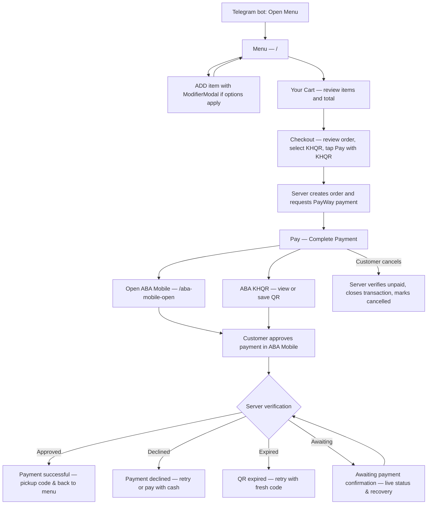
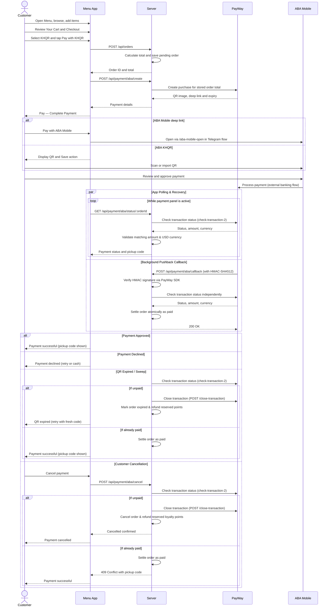

# Ai-Cha & Zhengda — ABA PayWay UI Flow

**Implementation Complete · Updated 8 September 2026**

This document details the ABA PayWay KHQR flow implemented in the Ai-Cha & Zhengda menu app and API server, suitable for merchant review and submission.

## 1. Customer screen flow

The current checkout calls the PayWay option **KHQR**. Review, payment-method selection, and confirmation happen together in **Checkout**. All customer views below use `/` as in-page states, except the external bridge `/aba-mobile-open?deeplink=…`. There are no separate `/cart`, `/checkout`, or payment-result routes.

KHQR also supports the banking-app path described in the existing UI; ABA Mobile is shown here for the ABA review. PayWay supplies the QR/deep link through the server; the menu app displays the QR. A hosted PayWay checkout page is not currently used. Closing ABA Mobile or cancelling its launch prompt does not establish payment cancellation.

## 2. UML sequence diagram

## 3. Screens and actions

| Screen / component | Route or state | Customer action | Next screen / result |
|---|---|---|---|
| Telegram bot | Outside app | Tap Open Menu | Menu |
| Menu (`App`, `MenuItemCard`) | `/`, menu tab | Browse; tap ADD | ModifierModal if options apply, or Cart update |
| Item options (`ModifierModal`) | `/`, modal | Select options & add to cart | Menu |
| Your Cart (`CartDrawer`) | `/`, drawer | Review cart; Proceed to Checkout | Checkout |
| Checkout (`CheckoutModal`, step 1) | `/`, modal | Select Pickup/Delivery, choose KHQR, tap Pay with KHQR | Pay (Step 2) |
| Pay — Complete Payment (`KhqrPaymentPanel`) | `/`, checkout step 2 | Choose Pay with ABA Mobile or ABA KHQR | Bridge or QR view |
| Open ABA Mobile (`AbaMobileOpenPage`) | `/aba-mobile-open?deeplink=…` | Tap Open ABA Mobile | External ABA Mobile payment |
| ABA KHQR (`KhqrPaymentPanel`) | `/`, QR view | Scan or save QR; pay in bank app | Awaiting payment confirmation |
| Payment successful (`App`, `CheckoutModal`) | `/`, success modal | Verified payment; view pickup code; Back to Menu | Menu |
| Payment declined (`KhqrPaymentPanel`) | `/`, in-panel error state | Bank declined transaction; Try again or pay with cash | Pay or Checkout |
| QR expired (`KhqrPaymentPanel`, `OrdersView`) | `/`, in-panel error state | QR validity window elapsed; Re-generate or reorder | Pay or Checkout |
| Awaiting confirmation (`KhqrPaymentPanel`, `App`) | `/`, in-panel / banner | Polling with manual "Check status" button & recovery pill | Verified result |
| Payment cancelled (`KhqrPaymentPanel`, `OrdersView`) | `/`, cancel confirmation | Cancel order confirmed with server; points refunded | Menu / Checkout |
| Orders (`OrdersView`) | `/`, orders tab | View active/past orders; Pay now for unpaid orders | KhqrPaymentPanel sheet |

## 4. Previous audit findings & resolution status

| # | Previous Audit Finding | Resolution Status | Implementation Details |
|---|---|---|---|
| 1 | **Missing payment result screens** | **Resolved** | Added distinct states in `KhqrPaymentPanel` and `App` for `Payment successful`, `Payment declined`, `QR expired`, `Awaiting payment confirmation`, and `Payment cancelled`. |
| 2 | **Unverified client-side settlement** | **Resolved** | Client never updates order to paid. Server validates transaction ID, matching amount, and USD currency via `/check-transaction-2` before marking order paid. |
| 3 | **Missing pushback webhook** | **Resolved** | Implemented `POST /api/payment/aba/callback` with `X-PayWay-HMAC-SHA512` signature verification and independent status re-check before atomic DB settlement. |
| 4 | **Risk of late charges after cancel/expiry** | **Resolved** | Both customer cancellation (`POST /api/payment/aba/cancel`) and background expiry worker call ABA PayWay Close Transaction API (`/api/payment-gateway/v1/payments/close-transaction`) to reject subsequent incoming payments. |
| 5 | **State loss on app reload or return from ABA Mobile** | **Resolved** | Stored active payment ID in `sessionStorage`; auto-restored on focus/reload; added top recovery banner ("You have an order awaiting payment confirmation") in `App`. |

## 5. Remaining external setup (ABA / Ops)

| Area | Requirement | Action Needed |
|---|---|---|
| **Pushback Webhook** | Register public webhook URL with ABA PayWay | Enter `https://<api-domain>/api/payment/aba/callback` in ABA Merchant Portal. |
| **Screenshot Submission** | Provide 12 screenshots of live payment flow | Capture updated screenshots from `https://staging-menu.aichazhengdaarakawa.com` for ABA compliance review. |
| **Background Cron** | Run periodic expiry sweep | Ensure API server background sweep (`SWEEP_INTERVAL_MS=30000`) is active. |

## 6. Screenshot submission checklist

1. `1 Start.jpg` — Telegram Open Menu.
2. `2 Select Item.jpg` — Menu and ADD actions with drink selections.
3. `3 View Cart.jpg` — Your Cart drawer with quantities and total.
4. `4 select method.jpg` — Checkout summary with KHQR selected.
5. `5 Payment.jpg` — Pay screen with ABA Mobile and ABA KHQR options.
6. `6 Pay with Deeplink.jpg` — Deep link bridge opening ABA Mobile.
7. `7 Pay with KHQR.jpg` — Merchant name, amount, KHQR code, and countdown timer.
8. `8 Payment Pending.jpg` — "Awaiting payment confirmation" screen with manual "Check status" button.
9. `9 Payment Successful.jpg` — "Payment successful" screen with verified pickup code and Back to Menu action.
10. `10 Payment Declined.jpg` — "Payment declined" screen showing bank decline advice.
11. `11 Payment Cancelled.jpg` — "Payment cancelled" screen confirmed by server.
12. `12 Orders Active.jpg` — Orders view showing pending and verified completed orders.
