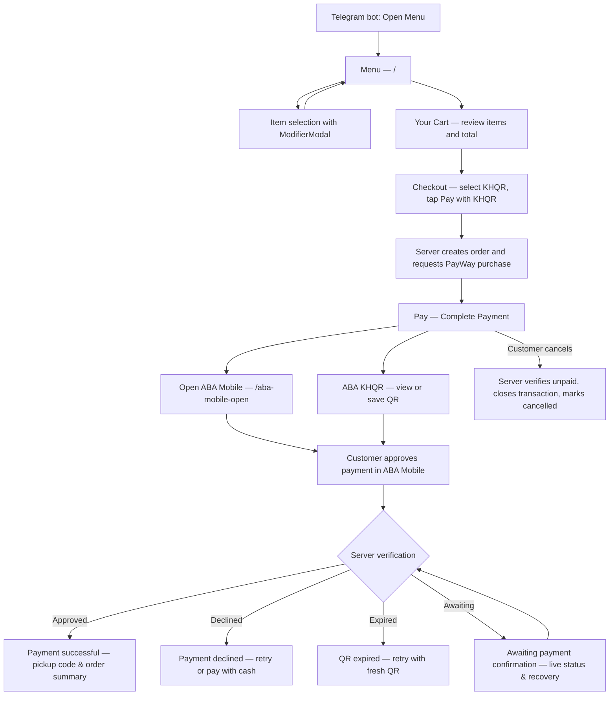
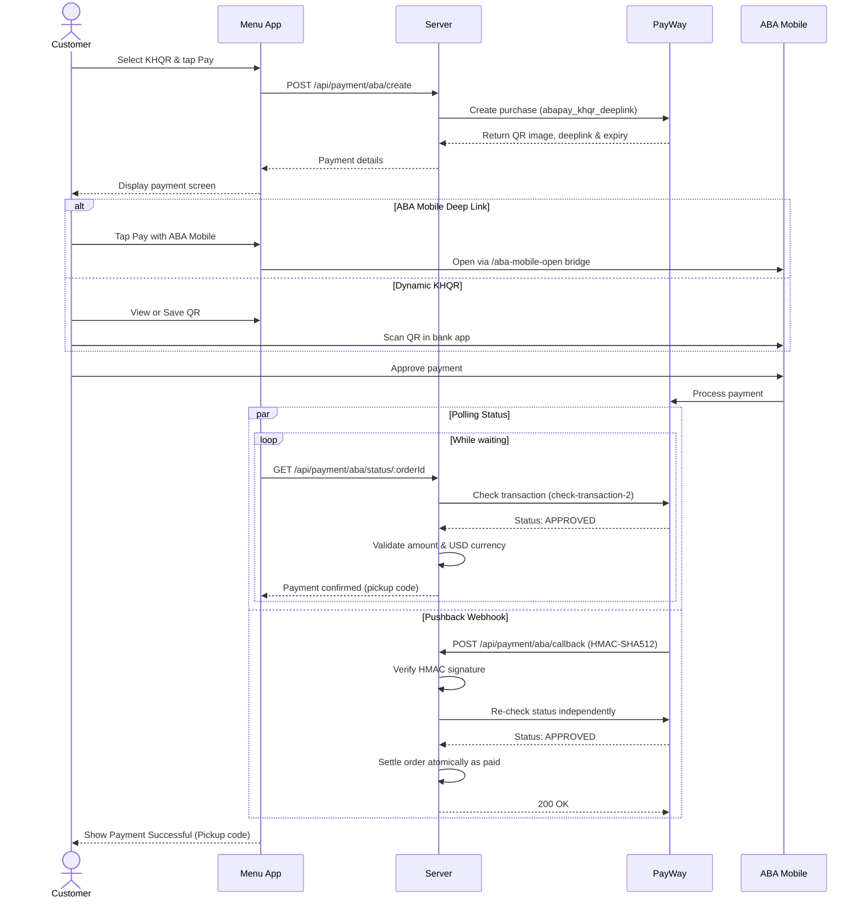
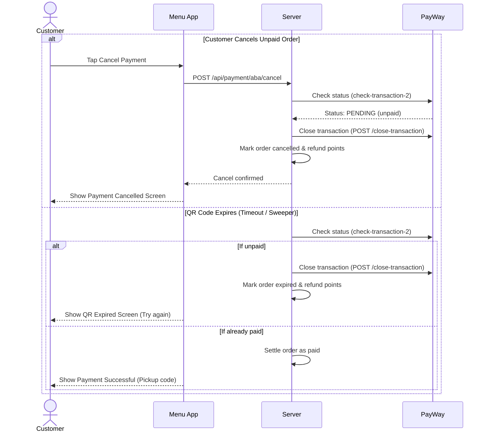

# Ai-Cha & Zhengda — ABA PayWay Integration & UI Flow Review

**Merchant Submission · September 2026**

- **Merchant Name:** Ai-Cha & Zhengda
- **Sandbox Merchant ID:** `ec460802`
- **Integration Type:** ABA PayWay Dynamic KHQR & ABA Mobile Deeplink (`abapay_khqr_deeplink`)
- **Staging WebApp:** `https://staging-menu.aichazhengdaarakawa.com`

---

## 1. Customer screen flow

Checkout uses ABA PayWay option **KHQR with ABA Mobile Deeplink**. Order review, payment selection, and confirmation happen within the checkout flow. All customer views operate as in-page states within the Telegram Mini App, with an external bridge (`/aba-mobile-open?deeplink=...`) for launching ABA Mobile.

PayWay supplies the QR data and deep link through the server API; the menu app renders the dynamic KHQR and deeplink button directly.

---

## 2. Sequence diagrams

### 2.1 Main payment flow (Success)

### 2.2 Cancellation & expiry handling

---

## 3. Screens and actions

| Screen / Component | Route or State | Customer Action | Next Screen / Result |
| --- | --- | --- | --- |
| Telegram Bot | Outside app | Tap Open Menu | Menu screen |
| Menu (`App`, `MenuItemCard`) | `/`, menu tab | Browse items; tap ADD | Item customization or Cart update |
| Item Options (`ModifierModal`) | `/`, modal | Select cup size, ice, sugar | Item added to Cart |
| Your Cart (`CartDrawer`) | `/`, drawer | Review items and total; tap Checkout | Checkout modal (Step 1) |
| Checkout (`CheckoutModal`, step 1) | `/`, modal | Select KHQR, tap Pay with KHQR | Payment Panel (Step 2) |
| Pay — Complete Payment (`KhqrPaymentPanel`) | `/`, checkout step 2 | Choose "Pay with ABA Mobile" or "ABA KHQR" | ABA Mobile launch or QR code view |
| Open ABA Mobile (`AbaMobileOpenPage`) | `/aba-mobile-open?deeplink=…` | Tap "Open ABA Mobile" | Switch to ABA Mobile app to approve |
| ABA KHQR View (`KhqrPaymentPanel`) | `/`, QR view | Scan or save dynamic QR | Pay in ABA Mobile or any Bakong bank app |
| Awaiting Confirmation (`KhqrPaymentPanel`, `App`) | `/`, in-panel / banner | Polling with manual "Check status" button | Automatic transition on settlement |
| Payment Successful (`App`, `CheckoutModal`) | `/`, success modal | Verified payment; view 4-digit pickup code | Order completed; tap "Back to Menu" |
| Payment Declined (`KhqrPaymentPanel`) | `/`, error state | Bank declined transaction | Tap "Try again" (fresh QR) or pay cash |
| QR Expired (`KhqrPaymentPanel`, `OrdersView`) | `/`, error state | QR countdown window elapsed | Tap "Try again" to generate fresh QR |
| Payment Cancelled (`KhqrPaymentPanel`, `OrdersView`) | `/`, cancel state | Tap "Cancel order" and confirm | Order cancelled; points refunded |
| Order History (`OrdersView`) | `/`, orders tab | View active and past orders | Tap "Pay now" to resume pending order |

---

## 4. Security & PayWay Standards Compliance

| #   | Compliance Requirement                  | Status        | Implementation Details                                                                                                                                                                                                       |
| --- | --------------------------------------- | ------------- | ---------------------------------------------------------------------------------------------------------------------------------------------------------------------------------------------------------------------------- |
| 1   | **Dedicated Result Screens**            | **Compliant** | Implemented distinct views in `KhqrPaymentPanel` and `App` for `Payment successful`, `Payment declined`, `QR expired`, `Awaiting payment confirmation`, and `Payment cancelled`.                                             |
| 2   | **Server-Side Settlement Verification** | **Compliant** | Client never updates order to paid. Server validates transaction ID, matching amount (±$0.01 tolerance), and USD currency via ABA `/check-transaction-2` before marking order paid.                                          |
| 3   | **Pushback Webhook Verification**       | **Compliant** | Implemented `POST /api/payment/aba/callback` with `X-PayWay-HMAC-SHA512` signature verification and independent status re-check before atomic database settlement.                                                           |
| 4   | **Late Charge Prevention**              | **Compliant** | Both customer cancellation (`POST /api/payment/aba/cancel`) and background expiry sweep call ABA PayWay Close Transaction API (`/api/payment-gateway/v1/payments/close-transaction`) to reject subsequent incoming payments. |
| 5   | **State Retention & Recovery**      | **Compliant** | Active payment reference is preserved in `sessionStorage`; auto-restores on browser refocus/reload; provides recovery banner ("You have an order awaiting payment confirmation") in `App`.                                   |

---

## 5. Integration Endpoints & Whitelist URLs

Please whitelist the following domains and endpoints for merchant account `ec460802`:

### Staging / Sandbox Environment

| Purpose                              | Type                  | Whitelist Target                                                       |
| ------------------------------------ | --------------------- | ---------------------------------------------------------------------- |
| **API Caller Host (Backend Server)** | Domain / Origin       | `staging-api.aichazhengdaarakawa.com`                                  |
| **Return / Cancel / Success URL**    | WebApp Frontend       | `https://staging-menu.aichazhengdaarakawa.com`                         |
| **Pushback Webhook**                 | Webhook POST Callback | `https://staging-api.aichazhengdaarakawa.com/api/payment/aba/callback` |

### Production Environment (for Go-Live)

| Purpose                              | Type                  | Whitelist Target                                               |
| ------------------------------------ | --------------------- | -------------------------------------------------------------- |
| **API Caller Host (Backend Server)** | Domain / Origin       | `api.aichazhengdaarakawa.com`                                  |
| **Return / Cancel / Success URL**    | WebApp Frontend       | `https://menu.aichazhengdaarakawa.com`                         |
| **Pushback Webhook**                 | Webhook POST Callback | `https://api.aichazhengdaarakawa.com/api/payment/aba/callback` |

